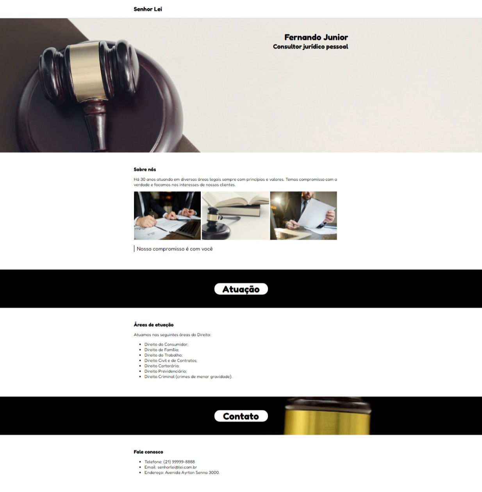

# SenhorLeiAdvocacia

Projeto simples de advocacia para mostrar como alterar o fundo de um elemento inserindo uma imagem para que ele tenha um maior destaque na página. Utilizando a propriedade backgroung-image juntamente com as propriedades background-repeat, 
background-position, background-size e background-attachment.

Layout da página:
